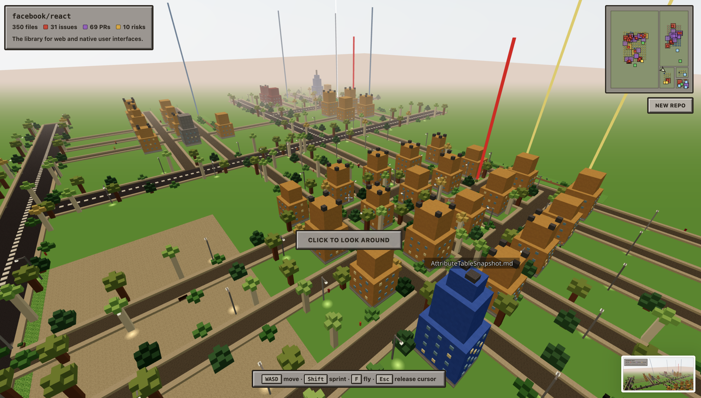
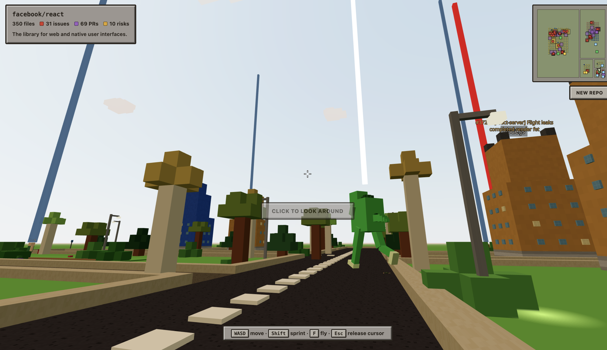
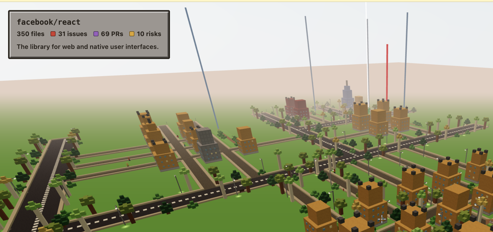
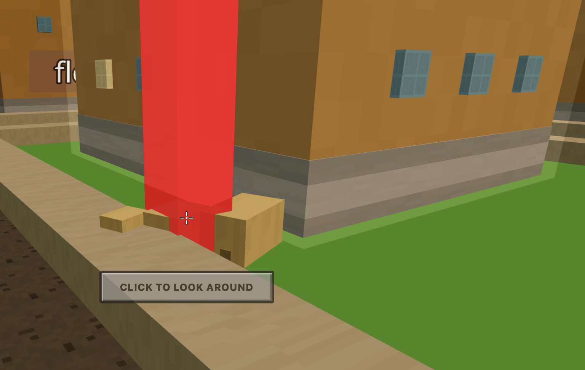
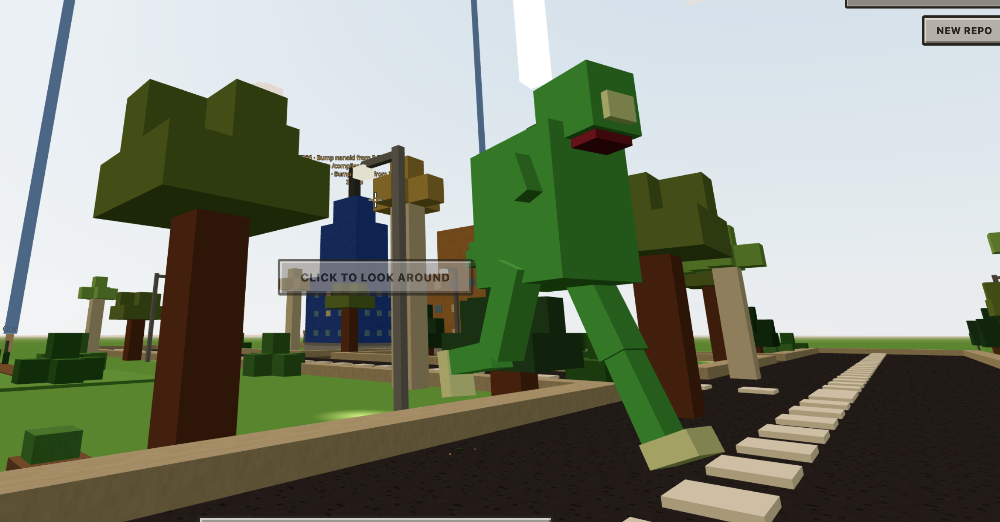
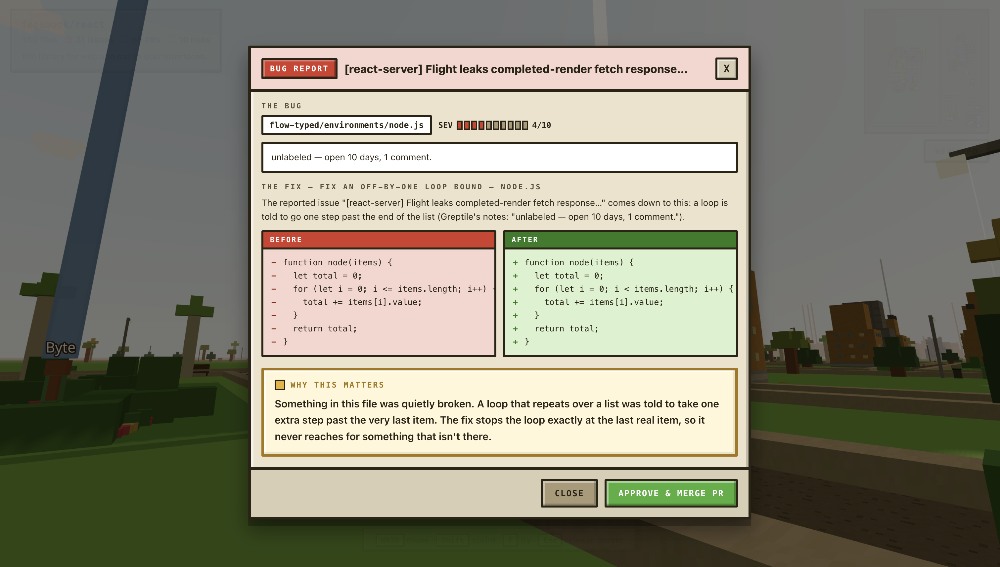
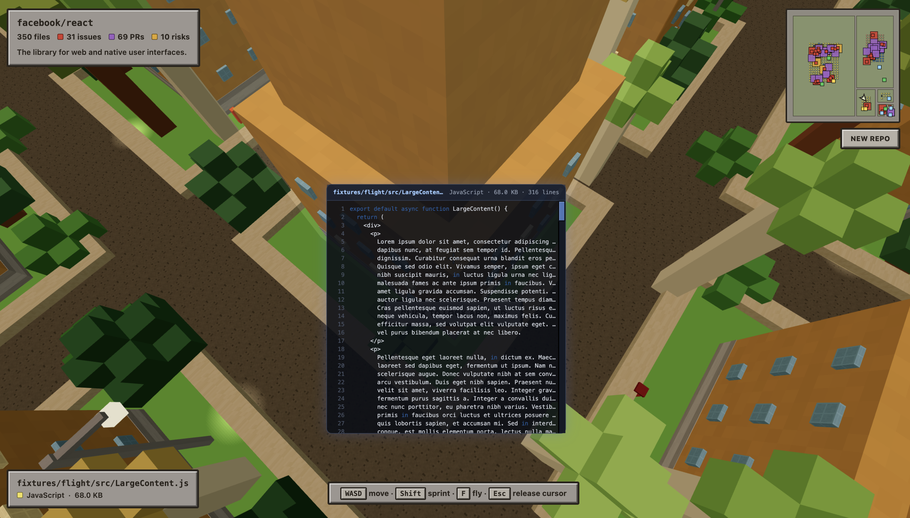

# Repo World

**A visual IDE you can walk through.** Paste a GitHub repo and it becomes an explorable
voxel city — every file a building, every directory a neighborhood, every open issue a
monster roaming the streets.

Then you fight back: aim at a bug, deploy **Greptile**, and watch it hunt the thing down.
When it lands, you get the real issue, a proposed fix, and a plain-English explanation of
why the code was broken.



---

## The idea

Codebases are invisible. You can read a file, but you can't *see* a system — where the
weight sits, which corners are rotting, what depends on what. Repo World makes a repository
a **place**, so understanding it becomes navigation instead of archaeology.

That framing does something a file tree can't: it makes problems **physical**. A neglected
module isn't a row in a backlog, it's a building with a monster outside it and a red beam
of light you can see from across town.



---

## How a repo becomes a city

| In your repo | In the world |
|---|---|
| File | A building — height from file size, material from language |
| Directory | A district, laid out by a squarified treemap weighted by file count |
| Import / dependency | A glowing arc between buildings |
| Open issue | A **bug** — a voxel creature, sized and colored by severity |
| Greptile risk finding | A bug too, flagged by analysis rather than by a human |
| Open PR | The number attached to the fix when a bug dies |
| Repo character | Roads, parks, trees, streetlights, parked cars, pedestrians |

Every placement is deterministic — seeded from file paths, never `Math.random()` — so the
same repo always produces the same city. Walk away and come back, and your landmarks are
where you left them.



---

## The loop

### 1. Find a bug

Bugs carry **red beacon columns** visible from anywhere in the city. Green beams mark
Greptiles, gold and blue mark quest-giving NPCs. Navigate by light.



### 2. Deploy Greptile

Put your crosshair on the bug — or anywhere on its beam — and press **E**. The nearest
idle Greptile in the roaming pack is dispatched and stomps across the city toward it.



### 3. Read the fix

When Greptile catches the bug, the review panel opens: the real issue, its severity, a
before/after diff of the proposed fix, and a **"Why this matters"** explanation written for
someone who doesn't already know the codebase.



### 4. Read the actual code

Walk up to any building to see its real source, streamed from GitHub. Press **Esc** to free
your cursor, then click and scroll to read the whole file.



---

## Controls

| Key | Action |
|---|---|
| `W` `A` `S` `D` | Move |
| `Shift` | Sprint |
| `Space` | Jump (rise while flying) |
| `C` | Descend while flying |
| `F` | Toggle fly — the best way to see the whole city |
| `G` | Get into / out of the nearest car (amber beacons mark them) |
| `R` | Speak with the Wise Wizard (violet beacon) |
| `Enter` | While the wizard chat is open: start typing (`Esc` returns you to walking) |
| `E` | Deploy Greptile on the targeted bug |
| `T` | Talk to a nearby NPC |
| `Esc` | Release the cursor (then click a code panel to scroll it) |
| Click | Capture the mouse to look around |

Three drivable cars are parked on the arterials near where you spawn, each under an
amber beacon. Get in with `G` and the camera drops into a chase view behind the car:
`W`/`S` drive and reverse, `A`/`D` steer, `Shift` boosts to ~44 u/s, `Space` is the
handbrake. `G` again puts you back on the pavement beside it.

---

## Run it

```bash
npm install
npm run dev        # http://localhost:5173
npm test           # 284 unit tests
npm run build && npm run preview
```

Type `demo` on the landing screen for a world that runs **fully offline** — no network, no
keys, no GitHub rate limit. It's the safest thing to show when conference wifi fails.

### API keys (all optional)

The app works with **zero keys**: public GitHub reads, a procedural voxel sky, and a
heuristic risk model. Keys upgrade it. Create `.env`:

```sh
GREPTILE_API_KEY=   # real codebase risk analysis + fix explanations
GITHUB_TOKEN=       # required BY Greptile to index; also lifts GitHub's
                    # rate limit from 60/hr to 5,000/hr
BLOCKADE_API_KEY=   # AI-generated sky (otherwise: procedural voxel sky)
```

These are read **server-side** and never reach the browser — the client only ever sees
booleans like `__HAS_GREPTILE__`. Locally that's handled by a Vite dev-server proxy; in
production by the serverless functions in `api/`.

> Greptile indexing takes 3–5 minutes on a fresh repo. **The world never waits for it** —
> it renders immediately with heuristic risks and swaps in Greptile's real findings the
> moment they arrive.

---

## Architecture

The pipeline is **progressive**. A playable city appears in a few seconds; dependency
edges, Greptile's analysis, and the generated sky stream in afterward and re-render in
place.

```
repo URL
   └─ github.js      fetch tree, issues, PRs, file contents   (all GET — never writes)
       └─ layout.js  squarified treemap → districts, buildings, roads, plots, sidewalks
           ├─ hazards.js   issues + PRs + risks → placed dangers
           ├─ deps.js      parse imports → dependency edges
           ├─ greptile.js  index + query for the riskiest files
           └─ skybox.js    generated environment (optional)
               └─ chase.js  bug/Greptile simulation, kill events → review panel
```

**`src/lib/`** — pure, unit-tested logic: `github`, `layout`, `deps`, `hazards`, `greptile`,
`skybox`, `chase`, `crowd`, `quests`, `targeting`, `fixes`, `pipeline`.
**`src/components/`** — the R3F scene: `Player`, `Buildings`, `Bugs`, `Greptile`, `Roads`,
`Nature`, `StreetProps`, `Pedestrians`, `NPCs`, `Hazards`, `DependencyLines`,
`SkyEnvironment`, plus the `HUD` / `Minimap` / `ReviewPanel` overlay.

### Performance

Everything repeated is instanced — one `InstancedMesh` per material, one shared
`BoxGeometry` for the entire world, tiny nearest-filtered textures generated once, and zero
allocation inside the frame loop. The ground renders as top-only tiles rather than full
cubes, cutting the scene from ~989k triangles to ~310k.

---

## Does it modify your repo?

**No.** Every GitHub call is a `GET` — verified by instrumenting `fetch` at runtime through
a full deploy-and-kill cycle. The only writes in the app are POSTs to *Greptile* (`/query`
to analyze, `/repositories` to index).

The PR number shown on a kill is read from an **existing** open PR. The fix in the review
panel is a **proposal**, never committed. "Approve & Merge PR" advances the game, not your
git history. A read-only token is all this ever needs.

---

## Deploying

Configured for Vercel. `vercel.json` pins the Vite framework and `dist` output; the
functions in `api/` replace the dev-server proxy in production and inject credentials
server-side. Set `GREPTILE_API_KEY` and `GITHUB_TOKEN` in the project's environment
variables — and **redeploy after adding them**, since they're bound at build time.

---

## Built at the Greptile Fast Hackathon

Built in an afternoon, with OpenAI Codex as the primary coding agent and Greptile's API
powering the risk analysis behind every monster in the city.
